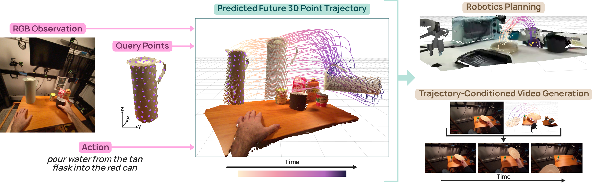
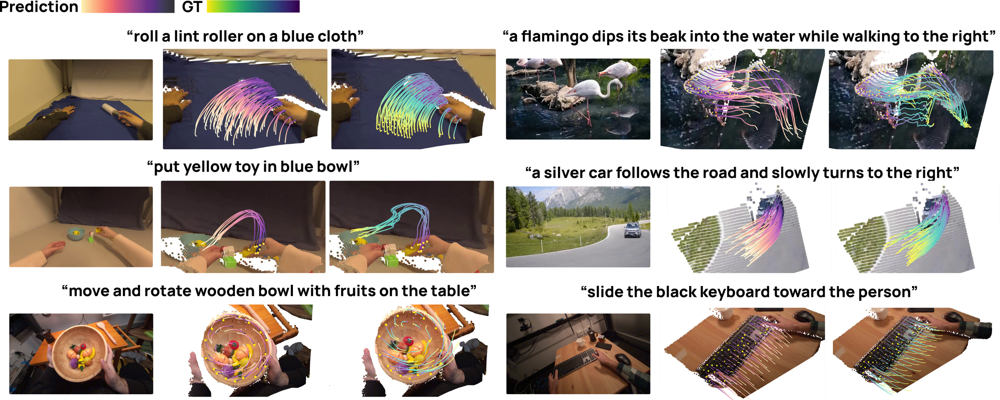

<div align="center">
  <h1>MolmoMotion</h1>
  <h3>Forecasting Point Trajectories in 3D with Language Instruction</h3>
</div>

<p align="center">
  <a href="https://github.com/allenai/molmo-motion/blob/main/LICENSE">
    
  </a>
  <a href="https://arxiv.org/abs/2606.18558">
    
  </a>
  <a href="https://allenai.org/blog/molmo-motion">
    
  </a>
  <a href="https://huggingface.co/collections/allenai/molmomotion">
    
  </a>
  <a href="https://huggingface.co/datasets/allenai/molmo-motion-1m">
    
  </a>
  <a href="https://huggingface.co/datasets/allenai/PointMotionBench">
    
  </a>
</p>

<div align="center">
  
</div>

<br>

MolmoMotion is a 4B vision-language model that **forecasts 3D point
trajectories** under natural-language action instructions. Given a short
RGB observation history, a set of user-specified 2D query points with their
initial 3D positions, and a language description of the intended action,
the model predicts each query point's 3D trajectory for up to ~2 seconds
in the camera-frame-at-`t₀` coordinate frame. We show that the learned
motion prior transfers to robotics planning and to motion-guided video
generation.

This repository covers the **autoregressive (AR) variant** from the paper,
together with the [MolmoMotion-1M](https://huggingface.co/datasets/allenai/molmo-motion-1m)
training corpus and the [PointMotionBench](https://huggingface.co/datasets/allenai/PointMotionBench)
evaluation suite. See the [paper](https://arxiv.org/abs/2606.18558) or the
[blog post](https://allenai.org/blog/molmo-motion) for the full
methodology and results.

## Table of Contents
- [Setup](#setup)
  - [Installation](#installation)
  - [Downloading the Dataset and Benchmark](#downloading-the-dataset-and-benchmark)
  - [Downloading Released Models](#downloading-released-models)
    - [Backbone init for training from scratch](#backbone-init-for-training-from-scratch)
- [Quick Start](#quick-start)
- [Data and benchmark construction](#data-and-benchmark-construction)
- [Training](#training)
  - [Stage 1 — Pretrain (P=8, H=3, F=8, 40K steps)](#stage-1--pretrain-p8-h3-f8-40k-steps)
  - [Stage 2 — Long-horizon finetune (10K steps)](#stage-2--long-horizon-finetune-10k-steps)
- [Evaluation](#evaluation)
  - [PointMotionBench benchmark eval](#pointmotionbench-benchmark-eval)
  - [Metric definitions (ADE / FDE / PWT)](#metric-definitions-ade--fde--pwt)
- [HuggingFace Conversion](#huggingface-conversion)
- [Robotics: MolmoBot finetuning](#robotics-molmobot-finetuning)
- [Citation](#citation)
- [License](#license)

# Setup

## Installation

```bash
git clone https://github.com/allenai/molmo-motion.git
cd molmo-motion
conda create -n molmo-motion python=3.11 -y
conda activate molmo-motion
pip install -e .[viz]
```

> **GPU / driver note.** `pip install` pulls the default PyTorch wheels,
> which target the newest CUDA runtime and may not match an older driver
> (`torch.cuda.is_available()` then returns `False`). If so, install a torch
> build matching your driver from the PyTorch index, e.g. for a CUDA 12.8
> driver:
> ```bash
> pip install "torch==2.9.1" torchvision "torchcodec==0.9.*" \
>     --index-url https://download.pytorch.org/whl/cu128
> ```
> `torchcodec` must match the torch minor version (0.9.x ↔ torch 2.9). The
> video decoder also needs FFmpeg shared libraries on the system
> (`conda install -c conda-forge ffmpeg`); the bundled training/eval recipes
> decode with OpenCV and do not require it, but the `torchcodec_exact` path
> does.

Installation registers three console scripts:

| Command | Purpose |
|---|---|
| `molmo-motion-train` | torchrun-compatible YAML-config training driver (the released recipes use `torchrun launch_scripts/sft.py` directly — see [Training](#training)) |
| `molmo-motion-eval` | torchrun-compatible YAML-config evaluation driver |
| `molmo-motion-convert-hf` | OLMo-native → HuggingFace checkpoint converter |

## Downloading the Dataset and Benchmark

Training and evaluation read two separate corpora from HuggingFace:

| Path | Used for | HF repo |
|---|---|---|
| `MOLMO_MOTION_1M_ROOT` | Training | [`allenai/molmo-motion-1m`](https://huggingface.co/datasets/allenai/molmo-motion-1m) |
| `POINTMOTIONBENCH_ROOT` | Evaluation | [`allenai/PointMotionBench`](https://huggingface.co/datasets/allenai/PointMotionBench) |

Export both before running anything in this README. The two roots must
point at **new directories outside this repo** — they will be populated
by `hf download` below. Do not point them at
[`dataset_recipes/`](dataset_recipes/) or
[`pointmotionbench/`](pointmotionbench/), which only hold recipes and
documentation.

```bash
export MOLMO_MOTION_1M_ROOT=/your/path/to/molmo-motion-1m
export POINTMOTIONBENCH_ROOT=/your/path/to/PointMotionBench
```

Download:

```bash
# Training corpus.
hf download allenai/molmo-motion-1m \
    --repo-type dataset --local-dir $MOLMO_MOTION_1M_ROOT

# Evaluation benchmark — only needed for `launch_scripts/eval_pointmotionbench.py`.
hf download allenai/PointMotionBench \
    --repo-type dataset --local-dir $POINTMOTIONBENCH_ROOT
```

Layout after download:

```
$MOLMO_MOTION_1M_ROOT/
├── egodex/         annotations/  tracks/  camera/
├── ytvis/          annotations/  tracks/  camera/
├── hdepic/         annotations/  tracks/  camera/
├── xperience/      annotations/  tracks/
├── stereo4d/       annotations/  track_index/
├── droid/          annotations/  tracks/  camera/    # robot teleop, NOT used by the default recipe
└── molmospaces/    annotations/  tracks/  camera/  videos/    # sim, NOT used by the default recipe

$POINTMOTIONBENCH_ROOT/
├── hot3d/
├── worldtrack/
└── davis/
```

The five datasets above the line are the ones the public training recipe
uses (see [Training](#training)). DROID and MolmoSpaces ship under the same
root for users who want to extend the recipe, but the bundled recipe does
not touch them.

Most datasets ship annotations + tracks + per-frame camera; the raw videos
(and, per dataset, some derived signals) are license-restricted and are
reconstructed locally from each subset's original source. Each dataset
directory on HuggingFace includes its own `README.md` and reconstruction
script — see [Data and benchmark construction](#data-and-benchmark-construction).

## Downloading Released Models

All released checkpoints are the **autoregressive (AR) variant** of
MolmoMotion. 

| Model | History H | Future F | HuggingFace |
|---|---:|---:|---|
| **MolmoMotion-4B-H3-F30** | 3 | 30 | [allenai/MolmoMotion-4B-H3-F30](https://huggingface.co/allenai/MolmoMotion-4B-H3-F30) |
| **MolmoMotion-4B-H1-F32** | 1 | 32 | [allenai/MolmoMotion-4B-H1-F32](https://huggingface.co/allenai/MolmoMotion-4B-H1-F32) |

```bash
hf download allenai/MolmoMotion-4B-H3-F30 \
    --local-dir checkpoints/MolmoMotion-4B-H3-F30
```

Pick H=3 / F=30 for typical video use (3 history frames, predict 2 seconds at
15 fps). Pick H=1 / F=32 when only a single query keyframe is available.

### Backbone init for training from scratch

Stage-1 training (see [Training](#training)) starts from the
**`Molmo2-4B-Pretrain`** checkpoint — the pretrain stage of
[Molmo2](https://github.com/allenai/molmo2), released by Ai2
alongside the Molmo2 codebase. Download URL is published in the Molmo2 README's
[Checkpoints table](https://github.com/allenai/molmo2#checkpoints):

```bash
wget https://storage.googleapis.com/oe-training-public/Molmo2-1225/Molmo2-4B-Pretrain.tar
tar -xvf Molmo2-4B-Pretrain.tar
# The extracted folder is what `/path/to/Molmo2-4B-Pretrain` refers to in Stage 1.
```
`oe-training-public` is an unauthenticated GCS bucket, so the `wget`
above works without any `gcloud` credentials.


# Quick Start

Below we run a single forward pass on a bundled clip and read the
`(P, F, 3)` future trajectory. Expected wall-clock on a single 80 GB A100:
~110 s for checkpoint load + ~40 s for `predict_trajectory()`.

For the full runnable script — including rendering the prediction as a 2D-track
MP4 over the `t₀` frame — see [`examples/01_quickstart.py`](examples/01_quickstart.py)
(`python examples/01_quickstart.py`, or `--from-prediction` to render from a
bundled prediction with no GPU). Details in [`examples/README.md`](examples/README.md).

```python
import torch
from PIL import Image

from molmo_motion import MolmoMotion, MolmoMotionProcessor

CKPT = "allenai/MolmoMotion-4B-H3-F30"

# 1. Load model + matching processor.
processor = MolmoMotionProcessor.from_pretrained(CKPT)
model = MolmoMotion.from_pretrained(CKPT)
model._internal = model._internal.to(torch.bfloat16).cuda()  # 4B params

# 2. Build one inference example. With the H=3 model:
#       history_frames        — three PIL images,  ordered earliest → t₀
#       points_2d_at_t0       — (P, 2) tensor of pixel coords at t₀
#       points_3d_history     — (H, P, 3) tensor in camera-frame-at-t₀
#       action                — short action description
#       future_horizon        — number of future frames to predict
EXAMPLE_DIR = "examples/data/davis_bmx_trees"
history_frames = [
    Image.open(f"{EXAMPLE_DIR}/frame_t-2.jpg").convert("RGB"),
    Image.open(f"{EXAMPLE_DIR}/frame_t-1.jpg").convert("RGB"),
    Image.open(f"{EXAMPLE_DIR}/frame_t+0.jpg").convert("RGB"),
]
points_2d_at_t0   = torch.load(f"{EXAMPLE_DIR}/points_2d_at_t0.pt")
points_3d_history = torch.load(f"{EXAMPLE_DIR}/points_3d_history.pt")
action = open(f"{EXAMPLE_DIR}/caption.txt").read().strip()

inputs = processor(
    history_frames=history_frames,
    points_2d_at_t0=points_2d_at_t0,
    points_3d_history=points_3d_history,
    action=action,
    future_horizon=30,
)
inputs = {k: v.cuda() if torch.is_tensor(v) else v for k, v in inputs.items()}

# 3. Forward.
with torch.inference_mode(), torch.autocast("cuda", dtype=torch.bfloat16):
    out = model.predict_trajectory(**inputs)

# 4. `out.future_3d` is the decoded prediction: a (P=8, F=30, 3) tensor of
#    absolute camera-frame XYZ coordinates in meters, one row per future
#    frame, for each of the 8 query points (no further parsing needed —
#    `predict_trajectory` already turned the raw `<tracks>` block into
#    floats and added the anchor back).
future_3d = out.future_3d.cpu().numpy()          # (8, 30, 3), meters
print(f"future_3d.shape: {future_3d.shape}")

# Per-point predicted positions at the first future frame (= t₀ + 1):
for pi in range(future_3d.shape[0]):
    x, y, z = future_3d[pi, 0]
    print(f"  point {pi}: (x={x:+.3f}, y={y:+.3f}, z={z:+.3f}) m")

# Point 0's full predicted trajectory across all 30 future frames:
print(f"point 0 trajectory (F=30): {future_3d[0].round(3).tolist()}")

# 5. Visualize straight from the prediction with `render_trajectory_mp4`
#    (defined in examples/01_quickstart.py): a 2D track over the t₀ frame.
render_trajectory_mp4(
    out.future_3d,
    t0_image=history_frames[-1],
    intrinsics=torch.load(f"{EXAMPLE_DIR}/intrinsics_K.pt"),
    points_2d_at_t0=points_2d_at_t0,
    output_path="davis_bmx_trees_2d.mp4",
)
```

# Data and benchmark construction

`MOLMO_MOTION_1M_ROOT` and `POINTMOTIONBENCH_ROOT` only land annotations,
tracks, and (for most datasets) camera when downloaded — the raw videos and
a few derived signals are license-restricted and rebuilt locally. The
recipes live in three places; each per-dataset `README.md` is
**authoritative**.

| Where | What it provides |
|---|---|
| [`allenai/molmo-motion-1m`](https://huggingface.co/datasets/allenai/molmo-motion-1m) (HF) | Per-dataset reconstruction for `MOLMO_MOTION_1M_ROOT` — each `<dataset>/` ships its `README.md` + `reconstruct_*.py` alongside the annotations (EgoDex, YT-VIS, HD-EPIC, Xperience, Stereo4D, DROID, MolmoSpaces). See [`dataset_recipes/`](dataset_recipes/) for the pointer. |
| [`pointmotionbench/`](pointmotionbench/) | Per-subset reconstruction for `POINTMOTIONBENCH_ROOT` (DAVIS / HOT3D / WorldTrack) |
| [`data_generation/`](data_generation/) | The pipeline code that annotates new raw videos with the same 3D track annotation schema |

After following the per-dataset READMEs (reconstruction adds `videos/`
and, per dataset, the remaining derived signals), the two roots look like:

```
$MOLMO_MOTION_1M_ROOT/
├── egodex/         annotations/  tracks/  camera/  videos/
├── ytvis/          ...
├── hdepic/         ...
├── xperience/      ...
├── stereo4d/       ...
├── droid/          ...
└── molmospaces/    ...

$POINTMOTIONBENCH_ROOT/
├── davis/
├── hot3d/
└── worldtrack/
```

Training reads from `$MOLMO_MOTION_1M_ROOT`; eval reads from
`$POINTMOTIONBENCH_ROOT`. No glue beyond setting the env vars.

> **Stereo4D heads-up.** The HuggingFace download ships only a `track_index/`
> for Stereo4D; `tracks/` and `camera/` are both rebuilt locally. Run
> `$MOLMO_MOTION_1M_ROOT/stereo4d/reconstruct_tracks.py` (per
> `stereo4d/README.md`) before `scripts/build_track_keys_cache.py`,
> otherwise the cache builder reports all 23,011 Stereo4D entries as
> missing NPZs.

# Training

MolmoMotion is trained in **two stages**. Both stages share the public
training mix — the five human-video datasets in MolmoMotion-1M
(EgoDex, YT-VIS, HD-EPIC, Xperience, Stereo4D); DROID and MolmoSpaces are
excluded by default. Both stages start from a **Molmo2-4B-Pretrain**
checkpoint as the VLM backbone.

We assume the corpus is downloaded as described in
[Downloading the Dataset and Benchmark](#downloading-the-dataset-and-benchmark)
and the env vars are exported.

```bash
export MOLMO_MOTION_1M_ROOT=/your/path/to/molmo-motion-1m
export POINTMOTIONBENCH_ROOT=/your/path/to/PointMotionBench
```

Before the first run, build the track-keys cache (a one-time scan that
lets the loader drop split entries whose NPZ keys diverged upstream):

```bash
python scripts/build_track_keys_cache.py
```

The training recipes log to [Weights & Biases](https://wandb.ai), so export
your project and entity before launching (the run aborts with an error if
either is unset):

```bash
export WANDB_PROJECT=molmo-motion
export WANDB_ENTITY=<your-wandb-entity>
# or disable logging entirely:  export WANDB_MODE=disabled
```

## Stage 1 — Pretrain (P=8, H=3, F=8, 40K steps)

Train on the five human-video datasets with sqrt-frequency mixing
(`p_i ∝ √N_i`) — this is the recipe the released `H3-Pretrain` model uses.

```bash
torchrun --nproc-per-node=8 launch_scripts/sft.py \
    /path/to/Molmo2-4B-Pretrain \
    trajectory_3d_human_p8_h3_f8 \
    --save_folder=checkpoints/MolmoMotion-Stage1 \
    --model.mm_preprocessor.video.max_frames=3 \
    --model.mm_preprocessor.image.max_crops=1 \
    --seq_len=2560 \
    --model.llm.max_sequence_length=2560 \
    --device_batch_size=2 \
    --max_duration=40000 \
    --save_interval=2000 \
    --eval_interval=5000
```

Recipe summary:

| Field | Value |
|---|---|
| Backbone init | `Molmo2-4B-Pretrain` |
| Dataset name | `trajectory_3d_human_p8_h3_f8` |
| Datasets in mix | egodex, ytvis, hepic, xperience, stereo4d |
| Mixing | sqrt-frequency |
| Points P | 8 |
| History H | 3 |
| Future F | 8 |
| Steps | 40,000 |
| Compute (released) | 16 GPUs (2 nodes × 8 GPUs) |
| Seq-len | 2560 |
| Precision | bf16 + FSDP2 |

The `_human` token expands to the 5-dataset mix above. To train on a custom
subset, list datasets explicitly:

```bash
# egodex only
trajectory_3d_egodex_p8_h3_f8
# 3-dataset ablation
trajectory_3d_egodex_xperience_hepic_p8_h3_f8
```

## Stage 2 — Long-horizon finetune (10K steps)

Continue from the Stage-1 checkpoint with a longer future horizon. Two
flavors are released, differing only in the history length:

```bash
# H=3, F=30 (typical 3-frame video setting)
torchrun --nproc-per-node=8 launch_scripts/sft.py \
    checkpoints/MolmoMotion-Stage1/step40000 \
    trajectory_3d_human_p8_h3_f30 \
    --save_folder=checkpoints/MolmoMotion-H3-F30 \
    --model.mm_preprocessor.video.max_frames=3 \
    --model.mm_preprocessor.image.max_crops=1 \
    --seq_len=6144 \
    --model.llm.max_sequence_length=6144 \
    --device_batch_size=2 \
    --max_duration=10000 \
    --save_interval=1000 \
    --eval_interval=2500

# H=1, F=32 (single-keyframe setting)
torchrun --nproc-per-node=8 launch_scripts/sft.py \
    checkpoints/MolmoMotion-Stage1/step40000 \
    trajectory_3d_human_p8_h1_f32 \
    --save_folder=checkpoints/MolmoMotion-H1-F32 \
    --model.mm_preprocessor.video.max_frames=1 \
    --model.mm_preprocessor.image.max_crops=1 \
    --seq_len=6144 \
    --model.llm.max_sequence_length=6144 \
    --device_batch_size=2 \
    --max_duration=10000 \
    --save_interval=1000 \
    --eval_interval=2500
```

Stage 2 uses the **same five-dataset mix** as Stage 1; only the future
horizon F and (for the H=1 variant) the history length H change. Every
annotated clip in the five datasets contributes to training — there is no
held-out human-corpus split. Evaluation is run separately on
[PointMotionBench](#evaluation), which never overlaps with training data.

# Evaluation

We evaluate on **PointMotionBench** (HOT3D + WorldTrack + DAVIS) following
the same setup as the paper:

- Predict future motion for up to **2 seconds at 15 fps** (F=30) — or F=32
  for the H=1 release.
- If the clip is shorter, evaluate only on the valid future frames.
- Use **all annotated query points per clip** (not just 8): the model
  predicts in `P=8` chunks, with metrics averaged across all points so
  the comparison is fair across model sizes.
- Best-of-1 deterministic decoding (greedy) by default; the paper reports
  best-of-5 numbers, see `--n_samples=5` to reproduce.

## PointMotionBench benchmark eval

`launch_scripts/eval_pointmotionbench.py` is single-rank — its inner
`full_rollout` driver does not shard configs across ranks. Run with
`--nproc-per-node=1` and one inference GPU; one full run is ~9 GPU-hours
total for both checkpoints across all three subsets at the default
`--max_points_per_clip 24` recipe.

```bash
# H=3, F=30 model
torchrun --nproc-per-node=1 launch_scripts/eval_pointmotionbench.py \
    checkpoints/MolmoMotion-4B-H3-F30 \
    --benchmarks hot3d,worldtrack,davis \
    --all_points \
    --fixed_t0 \
    --history 3 --future 30 \
    --output_dir eval_out/MolmoMotion-4B-H3-F30

# H=1, F=32 model
torchrun --nproc-per-node=1 launch_scripts/eval_pointmotionbench.py \
    checkpoints/MolmoMotion-4B-H1-F32 \
    --benchmarks hot3d,worldtrack,davis \
    --all_points \
    --fixed_t0 \
    --history 1 --future 32 \
    --output_dir eval_out/MolmoMotion-4B-H1-F32
```

Flag semantics:

| Flag | Meaning |
|---|---|
| `--all_points` | Don't sub-sample 8 query points per clip — chunk every visible point into groups of P=8 and average the metric across chunks. |
| `--max_points_per_clip 24` | Cap the per-clip visible-point pool *before* chunking, so each clip emits at most ⌈24 / P⌉ = 3 records. Matches the paper recipe; pass `0` to chunk every visible point (much slower; drifts from paper numbers). |
| `--fixed_t0` | Pin the query frame at `t = H − 1` so eval is deterministic across runs. Without this, `t₀` is randomized per clip. |

Output:

```
eval_out/MolmoMotion-4B-H3-F30/
├── hot3d/
│   ├── predictions.jsonl       # one JSON record per (video, obj, t0, batch) — gt_future_raw / pred_raw_combined / gt_future_vis / point_indices / caption / …
│   └── metrics.json            # ADE / FDE / PWT aggregates
├── worldtrack/…
├── davis/…
└── summary.json                # one-page rollup
```

`summary.json` reproduces the table format used in the paper:

```json
{
  "hot3d":      {"ADE": 0.109, "FDE": 0.217, "PWT": 0.444, "n_clips": 2475},
  "worldtrack": {"ADE": 0.143, "FDE": 0.261, "PWT": 0.445, "n_clips":  155},
  "davis":      {"ADE": 1.227, "FDE": 2.108, "PWT": 0.153, "n_clips":   90}
}
```

## Metric definitions (ADE / FDE / PWT)

All three are computed in 3D camera-frame meters and restricted to
visibility-masked frames (padded futures for short clips are excluded).

- **ADE** (Average Displacement Error, ↓) — mean L2 error across all
  visible query points and all predicted timesteps:
  `ADE = mean_{n,t}( ||p̂_t^n − p_t^n||_2 )`
- **FDE** (Final Displacement Error, ↓) — L2 error at the final
  predicted timestep:
  `FDE = mean_n( ||p̂_T^n − p_T^n||_2 )`
- **PWT** (Points Within Threshold, ↑) — average fraction of predicted
  points within `{0.01, 0.02, 0.05, 0.10, 0.20}` meters of ground truth,
  averaged across thresholds:
  `PWT = mean_{n,t,τ}( ||p̂_t^n − p_t^n||_2 ≤ τ )`

<div align="center">
  
  <br>
  <em>Predicted 3D point trajectories on PointMotionBench across diverse
  motion patterns and language instructions. See Section 4 of the
  <a href="https://arxiv.org/abs/2606.18558">paper</a> for the full quantitative
  comparison.</em>
</div>

<br>

# HuggingFace Conversion

Convert an OLMo-native unsharded checkpoint into a
`AutoModelForImageTextToText`-loadable HF directory:

```bash
molmo-motion-convert-hf \
    checkpoints/MolmoMotion-H3-F30/step10000-unsharded \
    hf_export/MolmoMotion-H3-F30 \
    --use_bfloat16
```

This produces:

```
hf_export/MolmoMotion-H3-F30/
├── config.json
├── generation_config.json
├── model-00001-of-00002.safetensors
├── model-00002-of-00002.safetensors
├── model.safetensors.index.json
├── modeling_molmo_motion.py        # bundled for `trust_remote_code=True`
├── configuration_molmo_motion.py
├── processing_molmo_motion.py
├── image_processing_molmo_motion.py
├── video_processing_molmo_motion.py
├── preprocessor_config.json
├── tokenizer_config.json
└── ...                              # tokenizer files
```

Push:

```bash
hf upload allenai/MolmoMotion-4B-H3-F30 \
    hf_export/MolmoMotion-H3-F30 .
```

# Robotics: MolmoBot finetuning

Use a MolmoMotion checkpoint as the initialization for a
[MolmoBot](https://github.com/allenai/molmobot) manipulation policy and
evaluate it on the
[MolmoSpaces](https://github.com/allenai/molmospaces) Franka pick-and-
place benchmark. The [`robotics/`](robotics/) subdirectory contains the
recipe.
See [`robotics/README.md`](robotics/README.md) for the full walkthrough.

# Acknowledgements

MolmoMotion is trained on [MolmoMotion-1M](https://huggingface.co/datasets/allenai/molmo-motion-1m),
which includes data derived from the
[Xperience](https://huggingface.co/datasets/ropedia-ai/xperience-10m) dataset. We thank
[Ropedia](https://huggingface.co/ropedia-ai) for Xperience.

**Disclaimer:** The Xperience-derived data is subject to Ropedia's terms and conditions.
Users who access or reconstruct that portion of the data must review and comply with the
terms on the [Xperience dataset page](https://huggingface.co/datasets/ropedia-ai/xperience-10m).

# Citation

```bibtex
@article{zhang2026molmomotion,
    title         = {MolmoMotion: Forecasting Point Trajectories in 3D with Language Instruction},
    author        = {Zhang, Jianing and Zheng, Chenhao and Yang, Yajun and Argus, Max and Soraki, Rustin and Han, Winson and Anderson, Taira and Li, Chun-Liang and Liu, Shuo and Duan, Jiafei and Ren, Zhongzheng and Zhang, Jieyu and Krishna, Ranjay},
    journal       = {arXiv preprint arXiv:2606.18558},
    year          = {2026},
    archivePrefix = {arXiv},
    eprint        = {2606.18558},
    primaryClass  = {cs.CV},
    url           = {https://arxiv.org/abs/2606.18558},
}
```

# License

Code: Apache 2.0. Trained model weights: Apache 2.0. Datasets carry
their respective upstream licenses — see the per-dataset README inside
[allenai/molmo-motion-1m](https://huggingface.co/datasets/allenai/molmo-motion-1m)
and [allenai/PointMotionBench](https://huggingface.co/datasets/allenai/PointMotionBench).

The vendored third-party models under
[`data_generation/third_party/`](data_generation/third_party/) carry their
own licenses, which are **not** all Apache 2.0: SAM 3 ships under Meta's
SAM License, and ViPE's dependency stack includes UniDepth under
CC BY-NC 4.0 (non-commercial). See the LICENSE / THIRD_PARTY_LICENSES
files in each vendored directory before commercial use of the
data-generation pipeline.
